# **Kelompo A18 ADPRO-A**
## **Udehnih**

|Nama Anggota                        |NPM                   |Pembagian Tugas                      |
|------------------------------------|----------------------|-------------------------------------|
|Aliefa Alsyafiandra Setiawati Mahdi |2306221056            |Payment 💰                           |
|Farrel Athalla Muljawan             |2306223925            |Course Browsing & Enrollment 🌐      |
|Madeline Clairine Gultom            |2306207846            |Fitur Course Creation & Management 🎓|
|Mahesa Farih Prasetyo               |2206081263            |Staff Dashboard 👩‍💼📊                |
|Sabina Maritza Moenzil              |2206027583            |Review & Rating ⭐📝                |
|Zufar Romli Amri                    |2306202694            |Report 📋🔍                         |

### Context Diagram (Madeline)
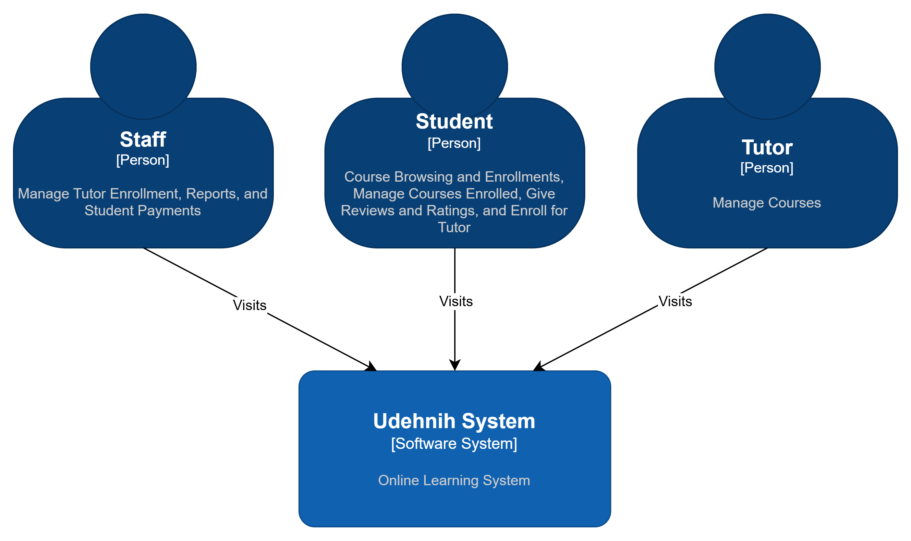

### Container Diagram (Madeline dan Zufar)
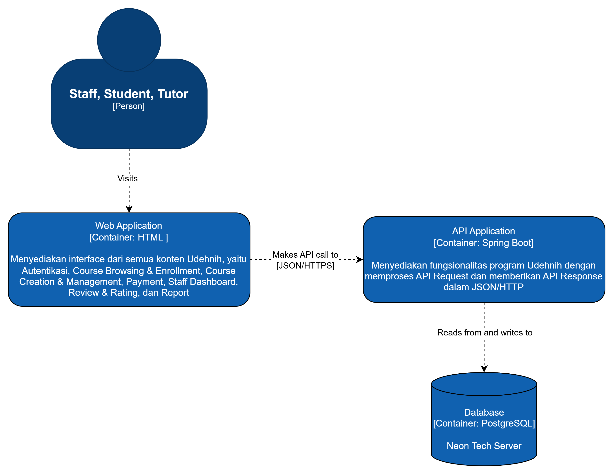

### Deployment Diagram (Zufar)
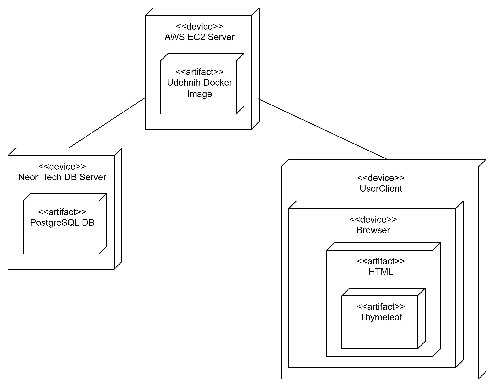

### Future Architecture (Madeline)
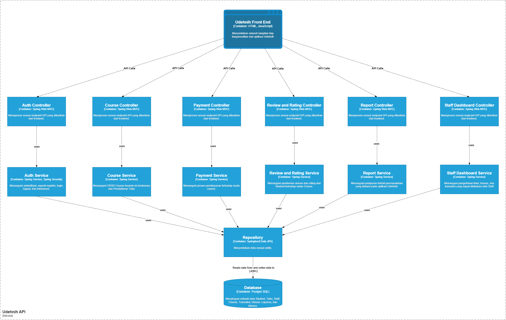

### Risk Storming (Madeline, Zufar, Aliefa, Farrel)
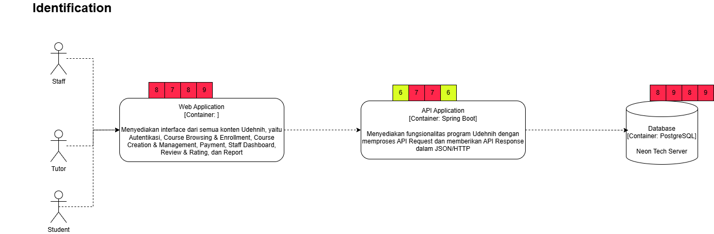
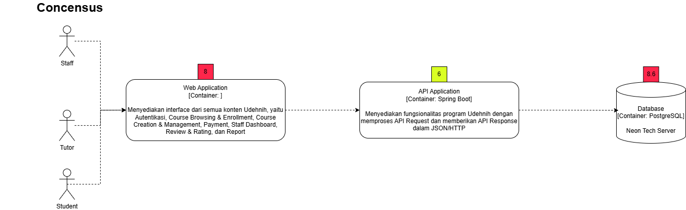

Berdasarkan analisis risk storming yang kami lakukan pada aplikasi Udehnih dengan struktur monolitik, terdapat beberapa area keamanan yang perlu diperhatikan. Pada Web Application, teridentifikasi risiko tinggi (level 8) yang mencakup potensi Cross-Site Scripting (XSS), Cross-Site Request Forgery (CSRF), dan kerentanan autentikasi. Hal ini kritis mengingat Web Application menangani hampir semua konten Udehnih, termasuk modul autentikasi, course browsing, payment, dan dashboard yang mengekspos berbagai titik masuk bagi penyerang.

Pada API Application, level risiko ditetapkan pada nilai 6 (menengah-tinggi) karena potensi adanya vulnerability pada API endpoints, risiko injeksi melalui API requests, dan kemungkinan serangan Denial of Service yang dapat melumpuhkan seluruh sistem. Struktur monolitik menghadirkan risiko tambahan dimana kegagalan pada satu bagian API dapat mempengaruhi seluruh fungsionalitas aplikasi.

Database memiliki risiko tertinggi (level 9), khususnya berkaitan dengan keamanan kredensial (R-DB01), SQL Injection (R-SEC01), dan kehilangan data (R-DAT01). Sebagai satu-satunya penyimpanan data untuk seluruh aplikasi, kegagalan pada Database akan berdampak luas pada operasional sistem. Kerentanan akses ke database utama melalui injeksi sangat mungkin terjadi mengingat struktur monolitik yang mengakses database yang sama untuk berbagai fungsi.

Berdasarkan use case yang diberikan, beberapa kerentanan spesifik yang teridentifikasi antara lain:
- Pada proses Register Tutor dan Course Creation: Risiko manipulasi input terutama pada pengisian formulir yang memungkinkan serangan injeksi (R-SEC01) dan pemalsuan identitas.

- Pada modul Payment: Kerentanan sistem pembayaran (R-OPS01) dapat terjadi karena akses langsung ke sistem pembayaran dari Web Application tanpa isolasi yang memadai, yang membuka peluang manipulasi status transaksi dan serangan phishing.

- Pada modul Staff Dashboard: Risiko tinggi pada autentikasi dan autorisasi terutama terkait kemampuan Staff untuk mengubah status Tutor dan Course, yang dapat dieksploitasi melalui kerentanan Session Hijacking (R-SEC02).

- Pada Course Review: Kerentanan XSS pada input review yang tidak tervalidasi dengan baik dapat digunakan untuk menyisipkan kode berbahaya yang akan dieksekusi oleh pengguna lain.

- Pada Report System: Risiko pengunggahan konten berbahaya dan injeksi meningkat karena penanganan Report bergantung pada komponen Web Application yang sama dengan fitur lainnya.

Kompleksitas yang tinggi dari arsitektur monolitik ini juga meningkatkan risiko kekeliruan Staff dalam validasi (R-OPS02), terutama pada fitur yang memerlukan persetujuan manual seperti pendaftaran Tutor dan pembuatan Course.

Untuk mitigasi, struktur microservices dapat menjadi solusi jangka panjang dengan memisahkan komponen-komponen kritis seperti Authentication, Payment, dan Course Management ke dalam layanan terpisah dengan database masing-masing, sehingga meminimalkan dampak kerentanan pada satu komponen terhadap keseluruhan sistem. Implementasi API Gateway dengan pembatasan rate dan autentikasi terpusat juga dapat memitigasi risiko DoS dan session hijacking. Perubahan arsitektur ke microservices, walau menawarkan manfaat keamanan seperti isolasi komponen kritis (Autentikasi, Pembayaran, Manajemen Kursus) dengan database terpisah dan implementasi API Gateway yang dapat mengurangi risiko DoS serta session hijacking, memerlukan pertimbangan matang sebelum diimplementasikan.

### Individual Container Diagram (Zufar)

#### Component Diagram
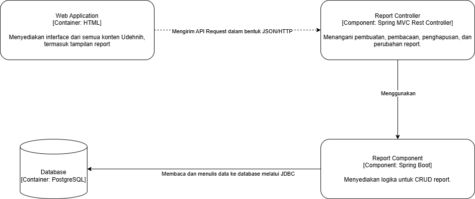

#### Code Diagram
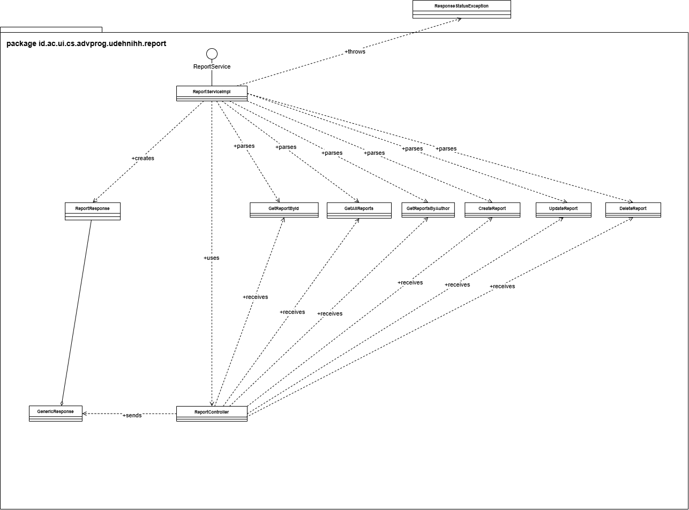

### Individual Container Diagram - Course Creation and Mangement (Madeline)

#### Component Diagram
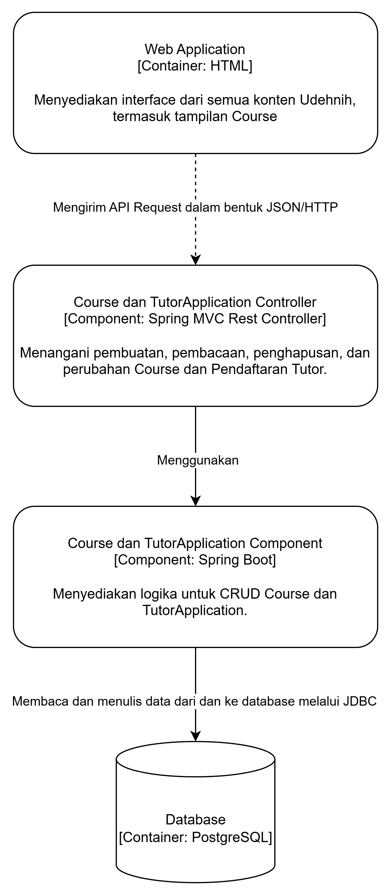

#### Code Diagram
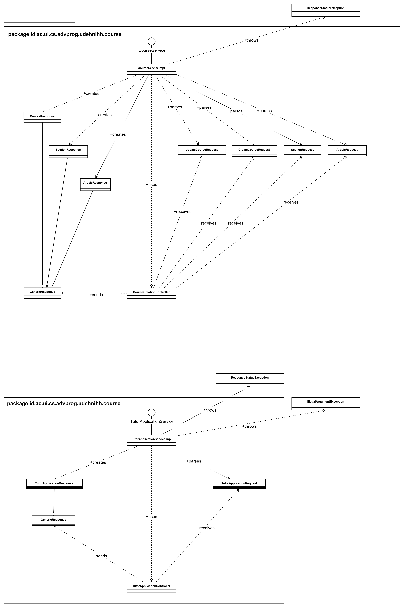

### Individual Container Diagram - Payment (Alie)
#### Component Diagram
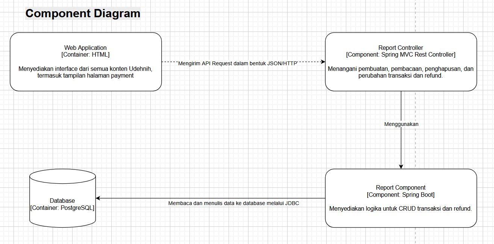
#### Code Diagram
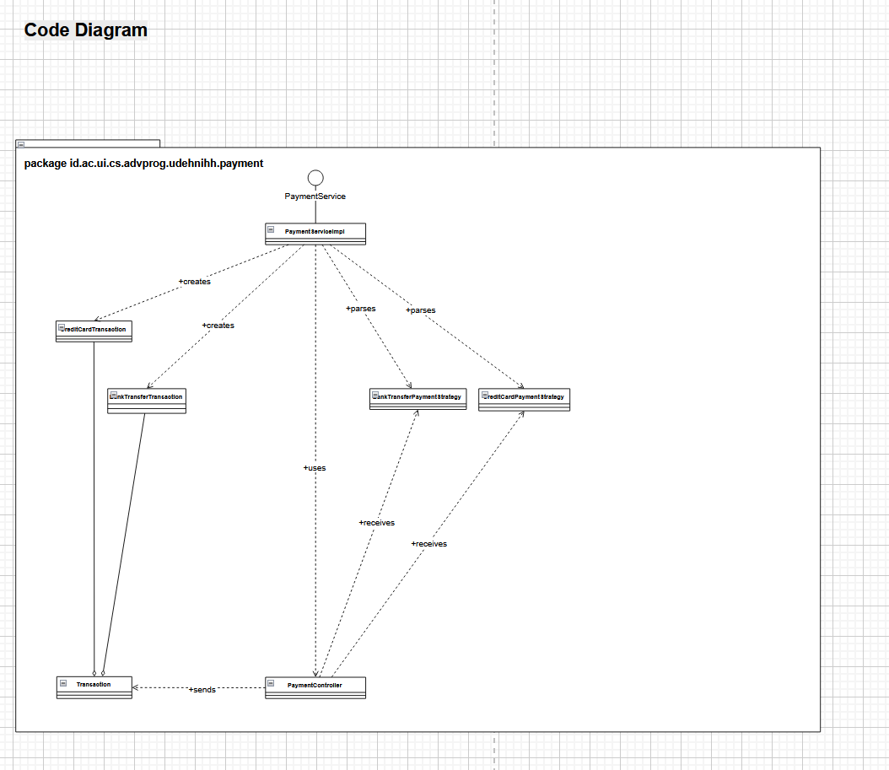
